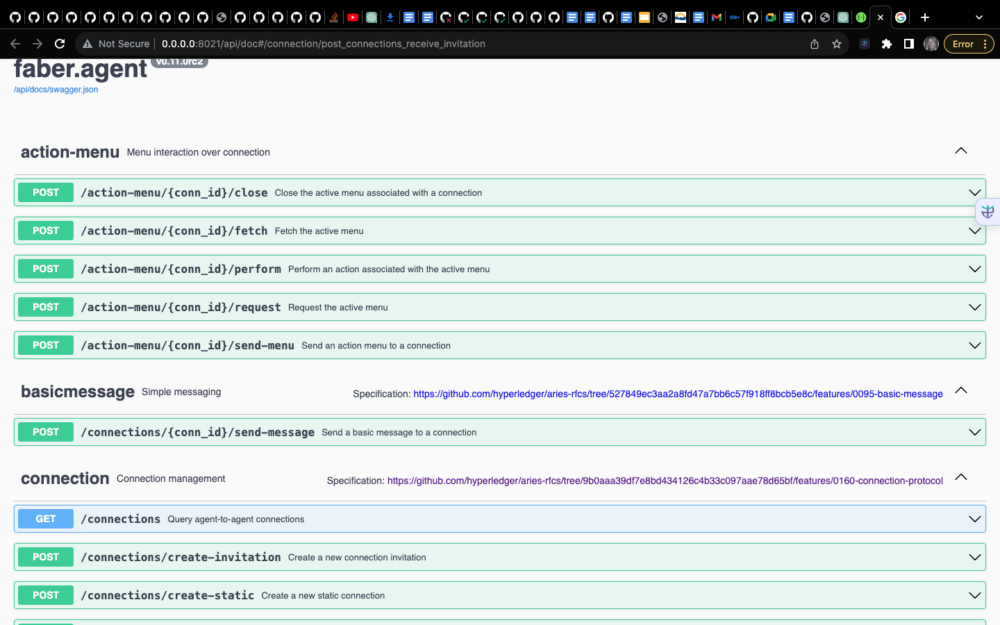

## Running the Demo Agents

This document guides you through setting up and running the demo agents for Aries Cloud Agent Python.

**Prerequisites:**

* Docker installed and running locally
* Terminal access

**Steps:**

1. **Navigate to the demo directory:**

   ```
   cd aries-cloudagent-python/demo
   ```

2. **Start the demo agents:**

2a. **Using the LEDGER_URL**
   - **Build the docker image**
      ```
      LEDGER_URL=http://dev.greenlight.bcovrin.vonx.io ./run_demo build alice
      ```
      * you can either build alice or faber

   - **Alice:**
      ```
      LEDGER_URL=http://dev.greenlight.bcovrin.vonx.io ./run_demo run alice --wallet-type askar-anoncreds --events
      ```
      
   - **Faber:**
      ```
      LEDGER_URL=http://dev.greenlight.bcovrin.vonx.io ./run_demo run faber --wallet-type askar-anoncreds --events
      ```
      or
      ```
      LEDGER_URL=http://dev.greenlight.bcovrin.vonx.io ./run_demo run faber --wallet-type askar-anoncreds --cred-type vc_di --events
      ```
      * Note: Indicating the type of credential as a flag is not required because you can set it by using the 1(a) option
      
   - **Acme:**
      ```
      LEDGER_URL=http://dev.greenlight.bcovrin.vonx.io ./run_demo run acme
      ```
      

2b. **Using the von network**

   - **Run the von network**
      - Clone the von network repo: ```git clone https://github.com/bcgov/von-network.git```
      - Start the network
         - Navigate into the von-network directory
         - Build the network image: In your there run this command ```./manage build```
         - Start the network: ```./manage start --logs```
      
   - **Build the docker image**
      ```
      ./run_demo build alice
      ```
      * you can either build alice or faber

   - **Alice:**
      ```
      ./run_demo run alice --wallet-type askar-anoncreds --events
      ```
      
   - **Faber:**
      ```
      ./run_demo run faber --wallet-type askar-anoncreds --cred-type vc_di --events
      ```
      
   - **Acme:**
     (not needed for our work)
      ```
      ./run_demo run acme
      ```
      

   - **Some flags to note for both Alice and Faber commands**
      * --wallet-type: specifes the wallet that will be used during this transaction. asker-anoncreds wallet support the w3c format so it is being used.
      * --cred-type: specifies the format of credential that is to be issued
      * --events: shows agent's event log; the payloads  will contain the connection request and acceptance message

3. **Access Agent APIs:**

   - **Alice:** http://0.0.0.0:8031/api/doc#/
   
   - **Faber:** http://0.0.0.0:8021/api/doc#/
   
   - **Acme:** http://0.0.0.0:8041/api/doc#/
   

4. **Connect Alice and Faber:**

   - Copy the invitation details from Faber's API.
   - Paste the invitation details into Alice's API to create a connection.

5. **Test interactions:**

   The following activities are available for testing agent interactions:

   - **(1) Issue Credential:** Issue a credential from Faber to Alice.
   - **(1a) Set Credential Type (indy):**  Change the type of credential being offered by Fab
   - **(2) Send Proof Request:** Faber requests a proof from Alice.
   - **(2a) Send *Connectionless* Proof Request:** Faber requests a proof from Alice without an established connection (requires a mobile client).
   - **(3) Send Message:** Send a message between agents.
   - **(4) Create New Invitation:** Create a new invitation in the specified agent.
   - **(T) Toggle tracing on credential/proof exchange:** Enable or disable tracing for debugging purposes.
   - **(X) Exit:** Close the demo agent.

**Additional Information:**

- The invitation details will look similar to this:

```json
{
  "@type": "https://didcomm.org/out-of-band/1.1/invitation",
  "@id": "d81f4d89-edeb-4412-b11a-d91fa9c10e6d",
  "label": "faber.agent",
  "handshake_protocols": ["https://didcomm.org/didexchange/1.0"],
  "services": [
    {
      "id": "#inline",
      "type": "did-communication",
      "recipientKeys": ["did:key:z6MkpvgF5rr28x2kHUBoJUbu5H38tiHcqihfCPad273EsZu5#z6MkpvgF5rr28x2kHUBoJUbu5H38tiHcqihfCPad273EsZu5"],
      "serviceEndpoint": "http://host.docker.internal:8020"
    }
  ]
}
```

**More Information at** 
```https://github.com/hyperledger/aries-cloudagent-python/tree/main/demo#readme```
